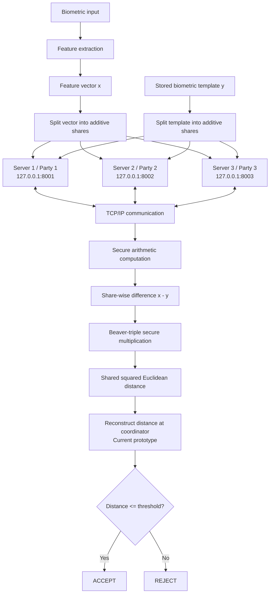

# Distributed Biometric Authentication using Secure Multi-Party Computation

## 1. Project Overview

### Proposed Title

**Communication-Efficient Distributed Biometric Authentication using Secure Multi-Party Computation**

### Core Idea

The project investigates whether biometric authentication can be performed without requiring any single server to possess the complete biometric template or authentication query in plaintext.

Instead of storing the biometric template at one centralized server, the biometric feature representation is divided into multiple secret shares and distributed among independent parties.

During authentication, a newly captured biometric is converted into a feature vector and similarly secret-shared. The participating servers then execute a Secure Multi-Party Computation (SMPC) protocol to calculate the similarity or distance between the enrolled template and authentication query without reconstructing either biometric vector.

The ultimate goal is to reveal only the authentication decision:

```text
ACCEPT
   or
REJECT
```

rather than exposing the biometric template, query, or raw matching score to any individual server.

---

# 2. Problem Statement

Biometric authentication systems commonly depend on a server-side representation of a user's biometric.

A simplified conventional architecture is:

```text
User
  ↓
Biometric sensor
  ↓
Feature extraction
  ↓
Feature vector
  ↓
Centralized server
  ↓
Stored biometric template
  ↓
Matching
  ↓
Accept / Reject
```

This creates a significant security and privacy concern.

A password can be replaced after compromise. A fingerprint, facial characteristic, iris pattern, or other biometric characteristic cannot simply be reissued.

Therefore, compromise of a centralized biometric database can have long-term consequences.

Traditional encryption can protect biometric data:

```text
Database
   ↓
Encrypted biometric template
```

but the server generally needs access to usable data during the matching operation.

This leads to the central question:

> **Can biometric authentication be performed while preventing any individual server from obtaining the complete biometric information required for authentication?**

This project investigates SMPC as a mechanism for achieving this property.

---

# 3. Design Objectives

The project has six primary objectives.

### Objective 1 — Distributed biometric storage

Prevent any single participating server from possessing the complete biometric template.

### Objective 2 — Privacy-preserving authentication

Perform biometric matching without reconstructing the complete biometric vectors in plaintext.

### Objective 3 — Distributed computation

Allow multiple independent parties to jointly calculate the matching function using secret-shared data.

### Objective 4 — Communication efficiency

Investigate and minimize the communication overhead introduced by distributed secure computation.

### Objective 5 — Practical authentication latency

Measure whether the resulting system can approach practical authentication latency under realistic network conditions.

### Objective 6 — Security analysis

Clearly define what an individual compromised server, colluding servers, or malicious server can learn or manipulate.

---

# 4. Candidate Project Selection

Before selecting SMPC-based biometric authentication, several technically complex approaches were considered.

## Candidate A — FHE-Based Biometric Matching

The first candidate was Fully Homomorphic Encryption (FHE).

The architecture would be:

```text
Biometric
    ↓
Feature extraction
    ↓
Feature vector
    ↓
Homomorphic encryption
    ↓
Encrypted feature vector
    ↓
Server
    ↓
Matching directly on ciphertext
    ↓
Encrypted distance
    ↓
Decryption
```

### Advantages

* Strong cryptographic privacy model.
* Computation can occur directly over encrypted data.
* Does not require the computation server to possess plaintext biometric data.
* Strong research potential around optimizing encrypted computation.

### Engineering challenges

FHE introduces substantial computational overhead.

Important constraints include:

* ciphertext size
* noise growth
* multiplicative depth
* polynomial/ring operations
* bootstrapping
* memory consumption
* ciphertext expansion
* computational latency

The matching function therefore has to be designed around the limitations of the FHE scheme.

### Reason for not selecting it

FHE would make the project primarily an **encrypted-computation optimization problem**.

The project would also have a relatively high implementation and experimentation barrier.

The intended project, however, is specifically interested in the intersection of:

```text
Cryptography
      +
Distributed Systems
      +
Networking
      +
Biometric Authentication
      +
Performance Engineering
```

SMPC provides a more direct path toward that combination.

---

# 5. Candidate B — Continuous Behavioral Authentication using Transformers

Another candidate was continuous authentication using behavioral biometrics.

Possible signals include:

* keystroke dynamics
* mouse movement
* scrolling behavior
* typing rhythm
* touchpad interaction

A Transformer could continuously analyze behavioral sequences and estimate whether the current user remains legitimate.

The major engineering problem would be reducing the computational and memory cost of attention over a continuously growing stream.

### Advantages

* Strong AI component.
* Direct connection to Zero Trust.
* Modern machine-learning research problem.
* Interesting optimization problem around attention and streaming inference.

### Reason for not selecting it

The project would depend significantly on:

* behavioral biometric datasets
* model training
* model architecture
* hyperparameter tuning
* user-specific behavioral drift
* ML evaluation

This would shift the project more heavily toward machine-learning research.

The SMPC project provides a stronger focus on **security architecture, cryptography, networking, and distributed systems**.

---

# 6. Why SMPC Was Selected

SMPC was selected because it provides the strongest balance between:

* cybersecurity relevance
* cryptographic depth
* distributed-systems complexity
* networking
* measurable performance
* practical implementation
* research potential

The key engineering trade-off is:

```text
Centralized system
        ↓
Lower communication overhead
        ↓
Higher trust in one server

              VS

Distributed SMPC system
        ↓
Reduced dependence on one trusted server
        ↓
Higher computation + communication overhead
```

Therefore, the project does not simply ask:

> "Can SMPC perform biometric authentication?"

Instead, the engineering question becomes:

> **How can SMPC-based biometric authentication be engineered to minimize the communication and latency overhead introduced by distributed secure computation while preserving the intended privacy guarantees?**

This creates a measurable optimization problem.

---

# 7. System Architecture

The proposed system consists of three major layers.

```text
┌──────────────────────────────────────────┐
│              CLIENT LAYER                │
│                                          │
│ Biometric Capture → Feature Extraction   │
└──────────────────────┬───────────────────┘
                       │
                       ▼
┌──────────────────────────────────────────┐
│          SECRET SHARING LAYER             │
│                                          │
│ Feature Vector → Multiple Secret Shares  │
└─────────────┬──────────┬──────────┬──────┘
              │          │          │
              ▼          ▼          ▼
        ┌─────────┐ ┌─────────┐ ┌─────────┐
        │ Party 1 │ │ Party 2 │ │ Party 3 │
        │ :8001   │ │ :8002   │ │ :8003   │
        └────┬────┘ └────┬────┘ └────┬────┘
             │           │           │
             └───────────┼───────────┘
                         ▼
              ┌─────────────────────┐
              │ Secure Computation  │
              └──────────┬──────────┘
                         ▼
              ┌─────────────────────┐
              │ Secure Comparison   │
              └──────────┬──────────┘
                         ▼
                  ACCEPT / REJECT
```

---

# 8. Localhost Development Architecture

The first implementation will run entirely on one physical computer.

The three servers will be separate operating-system processes.

```text
                         One Computer
┌─────────────────────────────────────────────────┐
│                                                 │
│  Process 1          Process 2        Process 3 │
│  Party 1            Party 2          Party 3   │
│  :8001              :8002            :8003     │
│     │                  │                │      │
│     └──────────────────┼────────────────┘      │
│                        │                       │
│                 TCP/IP communication           │
│                                                 │
└─────────────────────────────────────────────────┘
```

The use of separate processes is important.

They should not simply be three functions inside one program pretending to be independent servers.

Each party should maintain its own:

* process memory
* secret shares
* protocol state
* network connection
* computation state

This allows the same architecture to later be deployed as:

```text
Machine A → Party 1
Machine B → Party 2
Machine C → Party 3
```

without fundamentally changing the MPC protocol.

---

# 9. Enrollment Flow

Enrollment occurs when a biometric is registered for the first time.

```text
User
 ↓
Biometric capture
 ↓
Feature extraction
 ↓
Feature vector y
 ↓
Secret sharing
 ↓
┌──────────┬──────────┬──────────┐
│ Share y₁ │ Share y₂ │ Share y₃ │
└────┬─────┴────┬─────┴────┬─────┘
     ↓          ↓          ↓
 Party 1     Party 2     Party 3
```

The complete biometric template is not stored at any individual party.

Conceptually:

```text
Template y

        Secret Sharing
             ↓
       ┌─────┼─────┐
       ↓     ↓     ↓
      y₁     y₂    y₃
```

The exact mathematical secret-sharing mechanism will be selected based on the chosen MPC protocol and threat model.

---

# 10. Authentication Flow

During authentication, a new biometric sample is captured.

```text
New biometric
      ↓
Feature extraction
      ↓
Query vector x
      ↓
Secret sharing
      ↓
x₁       x₂       x₃
 ↓        ↓        ↓
P1       P2       P3
```

The enrolled template remains distributed:

```text
y₁ → Party 1
y₂ → Party 2
y₃ → Party 3
```

The parties then execute the MPC protocol.

---

# 11. Matching Function

For the initial prototype, the matching function will be Euclidean distance.

Given:

```text
x = [x₁, x₂, ..., xₙ]

y = [y₁, y₂, ..., yₙ]
```

the squared Euclidean distance is:

$$
D(x,y)=\sum_{i=1}^{n}(x_i-y_i)^2
$$

A smaller value indicates greater similarity.

The authentication rule is:

$$
D(x,y) \leq T
$$

where `T` is the authentication threshold.

---

# 12. Secure Arithmetic

The individual parties do not receive plaintext `x` and `y`.

Instead, they hold shares.

Operations are therefore performed on the shares.

### Addition/subtraction

Many secret-sharing schemes allow addition and subtraction to be performed locally.

For example:

```text
x = x₁ + x₂ + x₃
y = y₁ + y₂ + y₃
```

Then:

```text
x - y
=
(x₁-y₁) + (x₂-y₂) + (x₃-y₃)
```

The parties can therefore derive shares of the difference without reconstructing `x` or `y`.

### Multiplication

Multiplication is more difficult.

The system therefore uses a secure multiplication mechanism such as **Beaver triples**.

Conceptually:

```text
Secret a
Secret b
   ↓
Secure multiplication
   ↓
Secret (a × b)
```

For Euclidean distance, the multiplication is required for:

```text
(xᵢ-yᵢ)²
```

This makes secure multiplication an important source of protocol complexity and communication overhead.

---

# 13. Current Prototype Flow



---

# 14. Current Prototype Security Limitation

The current prototype reconstructs the final distance at a coordinator.

Therefore:

```text
Shared distance
      ↓
Reconstruction
      ↓
Plaintext distance
      ↓
Threshold comparison
```

This exposes the matching score.

The system should therefore **not yet claim that only the final authentication decision is revealed**.

This is an intentional development stage.

It allows the fundamental mechanics of:

* secret sharing
* inter-party communication
* secure arithmetic
* secure multiplication
* distributed distance computation

to be implemented and tested independently before adding secure comparison.

---

# 15. Planned Security Improvement

The target architecture removes reconstruction of the plaintext distance.

Instead:


The intended property becomes:

```text
Individual party learns:
    its own share
    + protocol messages

Individual party does NOT learn:
    complete biometric
    complete template
    plaintext query
    plaintext matching distance

System reveals:
    ACCEPT / REJECT
```

This is the target privacy-preserving architecture.

---

# 16. Threat Model

The security of the system depends heavily on the threat model.

The project will explicitly distinguish between different adversaries.

## Semi-Honest / Honest-but-Curious Server

A server follows the protocol correctly but attempts to learn additional information from the data it observes.

This is an appropriate initial security model for the prototype.

## Malicious Server

A malicious party may deliberately deviate from the protocol.

Examples:

* sending malformed shares
* modifying protocol messages
* refusing to participate
* attempting to influence the result

Malicious security is more expensive and may be considered as an advanced stage.

## Colluding Servers

The project must investigate how privacy changes if multiple parties cooperate to reconstruct information.

For example:

```text
3 parties

Party 1 + Party 2
        ↓
      Collusion
```

The acceptable number of colluding parties depends on the selected sharing scheme and threshold.

Therefore, the project must explicitly state its collusion tolerance rather than simply claiming "distributed security."

---

# 17. Security Boundaries

The system has several distinct trust boundaries.

```text
Biometric Client
       │
       │
       ▼
Feature Extraction
       │
       │
       ▼
Secret Sharing
       │
       ├──────────────┐
       ▼              ▼
    Party 1         Party 2
       │              │
       └──────┬───────┘
              │
           Party 3
```

The project will investigate what information crosses each boundary and what an attacker can learn from compromising each component.

---

# 18. Communication Layer

The parties communicate over TCP/IP.

For the local prototype:

```text
Party 1 → 127.0.0.1:8001
Party 2 → 127.0.0.1:8002
Party 3 → 127.0.0.1:8003
```

The communication layer will be measured because communication is expected to be one of the major costs of SMPC.

Relevant measurements include:

* number of messages
* bytes transmitted
* number of communication rounds
* latency per round
* total network time
* serialization/deserialization overhead

---

# 19. Why Communication Efficiency Matters

SMPC changes the performance characteristics of biometric authentication.

A conventional centralized system can perform:

```text
Query
 ↓
Server
 ↓
Distance calculation
 ↓
Decision
```

with little network interaction.

SMPC introduces:

```text
Query
 ↓
Secret sharing
 ↓
Party 1 ─────┐
Party 2 ─────┼── Communication
Party 3 ─────┘
 ↓
Secure operations
 ↓
More communication
 ↓
Decision
```

Therefore, even if the mathematical computation itself is relatively inexpensive, communication can dominate the overall authentication latency.

This motivates the central optimization objective:

> **Minimize communication overhead without weakening the intended security properties.**

---

# 20. Performance Evaluation

The project will measure the system under progressively more realistic conditions.

## Experiment 1 — Localhost Baseline

All parties run on the same machine.

Measure:

* total authentication latency
* CPU usage
* memory usage
* bytes transferred
* number of messages
* number of rounds

## Experiment 2 — Feature Dimension

Test different feature-vector sizes:

```text
32 dimensions
64 dimensions
128 dimensions
256 dimensions
512 dimensions
1024 dimensions
```

Investigate how dimensionality affects:

* computation
* communication
* latency
* memory

## Experiment 3 — Number of Parties

Compare configurations such as:

```text
2 parties
3 parties
4 parties
5 parties
```

where supported by the selected protocol.

Investigate:

> Does additional distribution provide useful security/fault-tolerance benefits at an acceptable performance cost?

## Experiment 4 — Network Latency

Introduce controlled artificial latency:

```text
0 ms
10 ms
20 ms
50 ms
100 ms
```

This approximates progressively less favorable distributed environments.

## Experiment 5 — Bandwidth Constraints

Evaluate behavior under restricted network bandwidth.

This helps determine whether the protocol is communication-bound.

## Experiment 6 — Server Failure

Remove one party during execution.

Measure:

* whether authentication can continue
* whether the protocol aborts
* how much redundancy exists
* whether the chosen threshold permits fault tolerance

---

# 21. Key Performance Metrics

### Authentication Latency

$$
T_{auth}=T_{feature}+T_{sharing}+T_{communication}+T_{MPC}+T_{decision}
$$

This decomposition helps determine what actually limits the system.

### Communication Cost

Measure:

$$
C_{total} = \text{bytes transmitted by all parties}
$$

### Communication Rounds

Count the number of synchronization/interaction phases required by the protocol.

### Scalability

Evaluate how latency and communication change with:

* number of parties
* feature-vector dimension
* number of authentication requests

### Biometric Accuracy

The privacy-preserving architecture should not significantly degrade the underlying biometric matching performance.

Relevant metrics include:

* False Acceptance Rate (FAR)
* False Rejection Rate (FRR)
* Equal Error Rate (EER), where applicable
* authentication accuracy

---

# 22. Major Engineering Questions

The project will attempt to answer the following questions.

### Security

1. What does an individual party learn?
2. How many colluding parties can compromise privacy?
3. What happens if a party behaves maliciously?
4. What information is revealed by the final score?
5. Can the final score itself be hidden?

### Computation

6. Why is addition easier than multiplication in secret-sharing protocols?
7. How does Beaver-triple multiplication work?
8. What operations dominate the MPC computation?
9. How expensive is secure comparison?

### Networking

10. How many communication rounds are required?
11. How many bytes are transmitted?
12. How much does network latency affect authentication?
13. Does communication or computation dominate total latency?

### Scalability

14. What happens as feature-vector dimension increases?
15. What happens as the number of parties increases?
16. Can multiple authentication requests be processed concurrently?

### Reliability

17. What happens if one party becomes unavailable?
18. Can the system tolerate party failure?
19. What trade-off exists between privacy, redundancy, and performance?

---

# 23. Expected Engineering Contribution

The project should not be presented merely as:

> "An implementation of SMPC for biometrics."

The intended contribution is:

> **A measured and optimized distributed biometric authentication architecture that investigates the trade-off between privacy, communication overhead, computation, and authentication latency.**

The project therefore consists of three components:

```text
                PROJECT
                   │
       ┌───────────┼───────────┐
       ↓           ↓           ↓
   SECURITY    DISTRIBUTION  PERFORMANCE
       │           │           │
 Secret sharing  MPC parties  Latency
 Threat model    Networking   Bandwidth
 Collusion       Protocol     Rounds
 Privacy         Faults       Scalability
```

---

# 24. Development Stages

The project will be developed incrementally in approximately ten stages, moving from a minimal cryptographic prototype toward a realistic, performance-evaluated biometric authentication system.

### Stage 1 — Biometric Representation

Represent a biometric using a synthetic numerical feature vector.

```text
[42, 17, 83, 29, ...]
```

This allows the cryptographic and distributed components to be developed independently of biometric hardware and datasets.

### Stage 2 — Secret Sharing

Implement additive secret sharing and distribute the feature vector across multiple parties.

Verify that an individual party cannot reconstruct the original vector from its share alone.

### Stage 3 — Distributed Party Architecture

Run three independent MPC parties as separate processes on localhost:

```text
Party 1 → :8001
Party 2 → :8002
Party 3 → :8003
```

Establish the basic distributed architecture and party-to-party communication.

### Stage 4 — Secure Arithmetic

Implement arithmetic operations over secret shares, beginning with local addition/subtraction and progressing to secure multiplication using Beaver triples.

### Stage 5 — Secure Biometric Matching

Implement the squared Euclidean distance:

$$
D(x,y)=\sum_i(x_i-y_i)^2
$$

and verify that the distance can be computed without reconstructing the biometric vectors.

### Stage 6 — Functional Authentication Prototype

Initially reconstruct the final distance at a coordinator and perform the threshold comparison.

This establishes the first complete end-to-end prototype:

```text
Biometric
→ Feature Vector
→ Secret Sharing
→ Distributed Computation
→ Distance
→ Threshold
→ ACCEPT / REJECT
```

### Stage 7 — Secure Decision Protocol

Remove reconstruction of the plaintext distance and implement secure comparison against a shared threshold.

The target becomes:

```text
Shared Distance
      ↓
Secure Comparison
      ↓
Shared Decision Bit
      ↓
ACCEPT / REJECT
```

Only the final authentication decision should be revealed.

### Stage 8 — Real Biometric Integration

Replace the synthetic feature vectors with features extracted from an appropriate biometric modality.

Evaluate whether the privacy-preserving computation maintains acceptable biometric matching performance.

### Stage 9 — Performance Evaluation and Optimization

Measure and optimize:

* authentication latency
* communication volume
* communication rounds
* CPU and memory usage
* feature-vector dimensionality
* number of parties

Identify whether computation or communication is the dominant bottleneck.

### Stage 10 — Realistic Distributed Evaluation

Evaluate the system under progressively realistic conditions, including:

* artificial network latency
* bandwidth constraints
* different numbers of parties
* concurrent authentication requests
* party failures

Use the results to characterize the trade-off between **privacy, security, communication overhead, reliability, and authentication performance**.


---

# 25. Final Target Architecture

```text
                    USER
                     │
                     ▼
              Biometric Input
                     │
                     ▼
             Feature Extraction
                     │
                     ▼
              Feature Vector
                     │
                     ▼
              Secret Sharing
                     │
       ┌─────────────┼─────────────┐
       ▼             ▼             ▼
    Party 1       Party 2       Party 3
       │             │             │
       └─────────────┼─────────────┘
                     │
              SMPC Protocol
                     │
                     ▼
          Secure Distance Computation
                     │
                     ▼
            Secure Threshold Check
                     │
                     ▼
              Shared Decision Bit
                     │
                     ▼
              Reveal Only Result
                     │
              ┌──────┴──────┐
              ▼             ▼
           ACCEPT         REJECT
```

---

# 26. Final Design Principle

The central design principle of the project is:

> **No individual infrastructure component should need to possess the complete biometric information required to perform authentication.**

However, this privacy property introduces a cost:

```text
More distributed trust
        ↓
More secure computation
        ↓
More communication
        ↓
Higher latency
```

Therefore, the core engineering challenge is not simply implementing privacy.

It is finding the point at which:

$$
\boxed{
\text{Privacy} \quad \leftrightarrow \quad
\text{Performance} \quad \leftrightarrow \quad
\text{Reliability}
}
$$

are balanced well enough for practical biometric authentication.

The project will use the prototype to establish correctness first, then progressively optimize and evaluate this trade-off.
